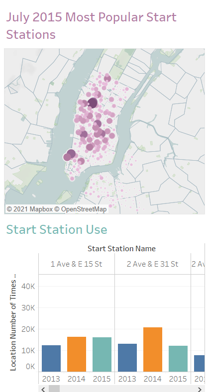
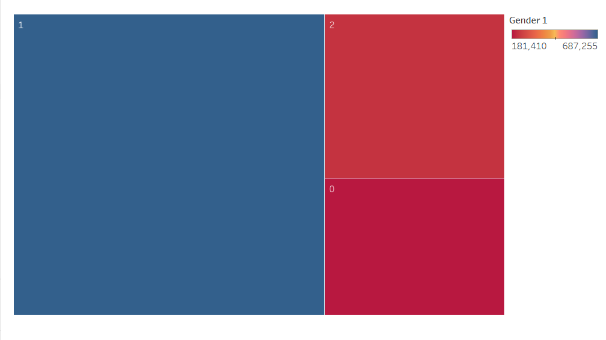
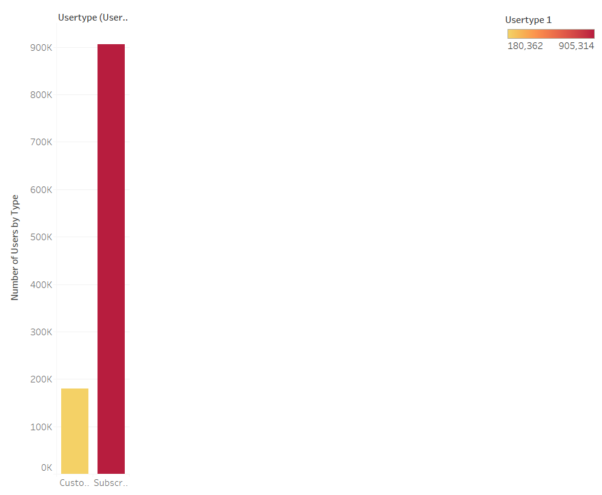

# Tableau Challenge
## City Bike Analytics

In this scenario, for the purpose of our analytics, it is tAugust of 2015 and the city bike initiative has been in play since 2013.
City officials would like to see if and how the program has grown annualy (in this case we will look at each July) so they can decide if this new program is worth continued investment. They would also like to know what the popular start and end stations are so they can allocate their resources accordingly.
Other insights for where the $$$ should go are also appreciated. 
[Tableau Story Link](https://public.tableau.com/profile/jessica.volosin#!/vizhome/CityBikeStory_16131401289180/CityBikeStory)

## Table of contents
* [Assignment](#assignment)
* [Data Sources](#data_sources)
* [Process](#process)
* [Visualizations](#visualizations)
* [Conclusions](#conclusions)

## Assignment
This homework assignment will demonstrate demonstrate proficiency in Tableau by displaying clear visualizations that provide helpful insights related to New York City Bike Data. 

## Data Sources
[New York Citi Bike](https://en.wikipedia.org/wiki/Citi_Bike)
Monthly data on city bike start and end stations names, locations, duration and demographic data. 

## Process  
  
   ### Extract  

        The extraction process for this project was simple. The csvs per month are provided in the website listed above. However, they are quite large so some manipulation is necessary in order to work with the data in Tableau.  

   ### Transform and Visualize
  
        The data was filtered in multiple jupyter notebooks to control the size of the csvs. The count of each user type was computed to see how many trips were taken. In a separate notebook the names of the stations were extracted into a csv.
        Then, in Tableau I was able to join these csvs on station name to diplay by size and color for start and stop locations, the number of visits. 

  
## Visualizations

## Conclusions
        The most popular start location is Penn Station, which makes sense because countless tourists and employees from out of state enter into the city through Penn Station each day. Another popular location is in lower Manhattan on Chamber St. This location is near the Staten Island Ferry and is right next to Battery Park. So logically it makes sense. A common scenario for renting a city bike would be for a tourist to take the ferry into the city, visit Battery Park since it is so close, then get their city bike at Chambers St. to head up to midtown and continue their tourist activities.
        Looking at the bar graphs for start and end location visits for July 2013, 2014, and 2015 we do see an overall trend up. 2013 was the first year of the program so one would excpect, if the program is successful, that the next two years would see growth since it is still early in the city bike program. I would feel confident, based on these graphs, telling the city officials that the city bike program is not a fad and has not lost popularity, it has continued to grow and is worth more investment.  
        The most popular end location is the south end of Central Park. This seems to make sense because it is far enough away from Penn Station (the most popular start location) where taking a bike or some other form of travel could be favorable over walking. Central Park is an extrememly popular location.  
        In the usertype bar graph we see that a person riding the city bike is more than four times more likely to be a subscriber than a customer. This means there are a lot of repeating customers. It would be beneficial to create incentives for the subscribers since they are loyal customers who keep returning to use the city bikes. 
        For the gender breakdown we have: 1 (in blue) is male, 2 (in red) is female, and 0 (in deep red) is unknown. As you can see, males are much more likely to use a city bike than females. To up usage of the bikes, it would be beneficial to incentivize use for females. One possible incentive would be to add a basket to some bikes for women to put their purses in as it can be difficult to ride a bike with a purse on your shoulder. This would benefit all genders as well since some males carry bags too. 
        In conclusion, this seems to be a popular program that is continuing to grow and still has room for more growth so it is worth continued investment.
